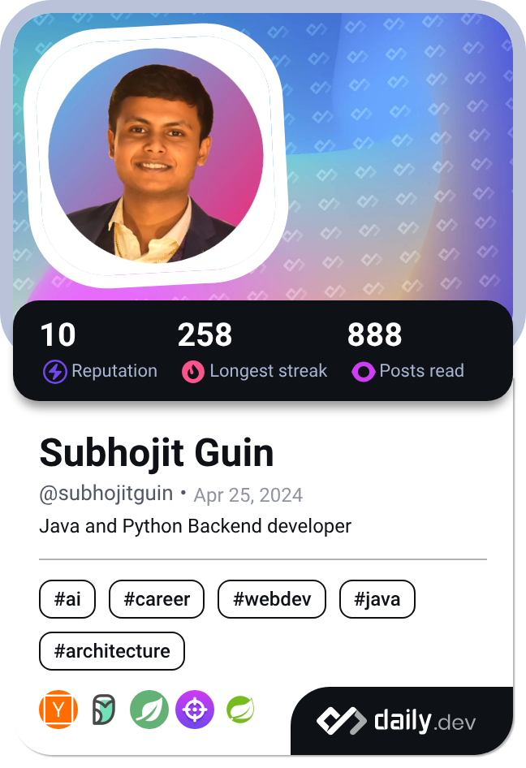

<h1 align="center">Hi 👋, I'm Subhojit Guin</h1>
<h3 align="center">Java Full-Stack Developer | Spring Boot · React · RESTful APIs | Cloud & AI Enthusiast</h3>

  
  
  
  

  

<!--

-->
---

## 💫 About Me

🎓 B.Tech Graduate in Computer Science & Engineering from **Institute of Engineering & Management, Kolkata (CGPA: 9.67/10)**.  
💼 Former **R&D Intern at Hyland Software** & **RPA Intern at Teoco**.  
🔭 Crafting backend solutions with **Java & Spring Boot** and diving deep into **System Design, HLD, LLD, and Microservices** to build software that scales.  
📚 **2x Scopus-indexed Research Publications** in computer vision & AI (Springer conference proceedings).  
🏆 Solved **800+ DSA problems** on LeetCode and GeeksforGeeks.   
🥇 Ranked **Top 2%** in IIT Kharagpur's Introduction to Algorithms and Analysis program.  
👯 Open to collaborating on **open source projects, Agentic AI solutions, Full Stack & Backend projects and microservices**.

---

## 🚀 Featured Projects

### Blog Management System
*Spring Boot · Spring MVC · Spring Security · JWT · PostgreSQL · Docker · ELK Stack · Flyway · JUnit · Mockito*

A production-grade content management backend with 30+ RESTful endpoints, stateless RBAC using JWT, BCrypt password hashing, and refresh token rotation. Optimized high-traffic data access with Hibernate ORM, dynamic filtering, and cursor pagination (eliminating N+1 queries). Enabled Log monitoring via ELK Stack and Spring AOP. Containerized with Docker Compose, versioned schema migrations via Flyway, and 85%+ test coverage across 400+ API test cases.

[👆Check out the project here](https://github.com/SubhojitGuin/Blog_Management_System)

---

### Project Risk Management System
*Python · FastAPI · CrewAI · AWS S3 · OpenAI API · FAISS · SMTP*

A 6-agent CrewAI pipeline using GPT-4o-mini for automated risk analysis, cross-domain risk scoring, risk classification, and mitigation strategy generation. Built a FastAPI backend with FAISS vector search for semantic report retrieval, AWS S3 for scalable storage, and real-time email alerts via SMTP.

[👆Check out the project here](https://github.com/SubhojitGuin/Project_Risk_Management)

---

## 🛠️ Tech Stack

<table style="width:100%">
  <tr>
    <td><strong>Languages</strong></td>
    <td><strong>Backend Frameworks</strong></td>
  </tr>
  <tr>
    <td></td>
    <td>
    
    
    
    
    
  </td>
  </tr>
  <tr>
    <td><strong>Frontend</strong></td>
    <td><strong>Databases</strong></td>
  </tr>
  <tr>
    <td>
    
    </td>
    <td></td>
  </tr>
  <tr>
    <td><strong>AI / ML & Agentic</strong></td>
    <td><strong>DevOps & Cloud</strong></td>
  </tr>
  <tr>
    <td>
      
      
      
      
    </td>
    <td>
      
      
      
      
      
    </td>
  </tr>
  <tr>
    <td><strong>Testing</strong></td>
    <td><strong>API & Docs</strong></td>
  </tr>
  <tr>
    <td>
      
      
    </td>
    <td>
      
      
      
    </td>
  </tr>
  <tr>
    <td><strong>IDEs & Build Tools</strong></td>
    <td><strong>Others</strong></td>
  </tr>
  <tr>
    <td></td>
    <td>
      
      
    </td>
  </tr>
</table>

---

## 📊 Stats

  
  
  <!--  -->

  
  

---

## 🏆 Achievements
- 🥇 Top 2% in IIT Kharagpur’s **Algorithms Program**  
- 🥇 **Hackathon Leader (5x)** – led teams to build impactful prototypes  
- 📄 Published **2 Scopus-indexed research papers** in Springer conference proceedings (computer vision & AI)  
- 📜 **LangGraph Certified** (2025) – Agentic AI orchestration  
- 📜 **Spring Framework & Spring Boot Certified** (2026) - Building scalable backends
---

<!-- ## 📊 GitHub Stats:
 
 
 -->

<!-- ## 🏆 GitHub Trophies -->
<!--  -->

<!-- ### 🔝 Top Contributed Repo -->
<!--  -->

## ✨ Let’s Connect

I'm actively seeking roles in **Java Backend and Full-Stack Development** — Open to on-site, hybrid and remote roles. Eager to collaborate on impactful projects.  

📫 Reach me at **[LinkedIn](https://linkedin.com/in/subhojit-guin-64a9b0269)** or **[Email](mailto:subhojitguin2004.work@gmail.com)**.
